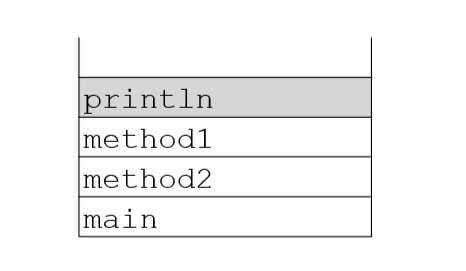

### 6-8. 다음 중 생성자에 대한 설명으로 옳지 않은 것은? (모두 고르시오)
- [ ] 모든 생성자의 이름은 클래스의 이름과 동일해야한다.
- [x] 생성자는 객체를 생성하기 위한 것이다.
  - 생성하기 위한 것이 아니라, 생성될 때 호출되는 '초기화 메서드'이다.
- [ ] 클래스에는 생성자가 반드시 하나 이상 있어야 한다.
- [ ] 생성자가 없는 클래스는 컴파일러가 기본 생성자를 추가한다.
- [x] 생성자는 오버로딩 할 수 없다.
  - overloading 가능하다.
--- 
### 6-9. 다음 중 this에 대한 설명으로 맞지 않은 것은? (모두 고르시오)
- [ ] 객체 자신을 가리키는 참조변수이다.
- [x] 클래스 내에서라면 어디서든 사용할 수 있다.
  - 객체 안에서만 사용가능하다.
- [ ] 지역변수와 인스턴스변수를 구별할 때 사용한다.
- [ ] 클래스 메서드 내에서는 사용할 수 없다.
---
### 6-10. 다음 중 오버로딩이 성립하기 위한 조건이 아닌 것은? (모두 고르시오)
- [ ] 메서드의 이름이 같아야 한다.
- [ ] 매개변수의 개수나 타입이 달라야 한다.
- [x] 리턴타입이 달라야 한다.
  - 반환타입은 상관없다.
- [x] 매개변수의 이름이 달라야 한다.
  - 매개변수의 이름은 상관없다.
---
### 6-11. 다음 중 아래의 add메서드를 올바르게 오버로딩 한 것은? (모두 고르시오)
> long add(int a, int b) { return a+b; }

- [ ] long add(int x, int y) { return x+y; }
  - 매개변수의 타입, 개수 같다.
- [x] long add(long a, long b) { return a+b; }
- [x] int add(byte a, byte b) { return a+b; }
- [x] int add(long a, int b) { return (int)(a+b); }
---
### 6-12. 다음 중 초기화에 대한 설명으로 옳지 않은 것은? (모두 고르시오)
- [ ] 멤버변수는 자동 초기화되므로 초기화하지 않고도 값을 참고할 수 있다.
- [ ] 지역변수는 사용하기 전에 반드시 초기화해야 한다.
- [x] 초기화 블럭보다 생성자가 먼저 수행된다.
  - 자 > 명 > 초 > 생 순서로 수행이다.
- [ ] 명시적 초기화를 제일 우선적으로 고려해야 한다.
- [x] 클래스변수보다 인스턴스변수가 먼저 초기화된다
  - cv -> iv 순서로 초기화된다.
---
### 6-13. 다음 중 인스턴스변수의 초기화 순서가 올바른 것은?
- [x] 기본값-명시적초기화-초기화블럭-생성자
  - 자 > 명 > 초 > 생
- [ ] 기본값-명시적초기화-생성자-초기화블럭
- [ ] 기본값-초기화블럭-명시적초기화-생성자
- [ ] 기본값-초기화블럭-생성자-명시적초기화
---
### 6-14. 다음 중 지역변수에 대한 설명으로 옳지 않은 것은? (모두 고르시오)
- [x] 자동 초기화되므로 별도의 초기화가 필요없다.
  - 초기화 꼭 해줘야한다. 별도의 초기화가 필요없는것은 iv이다.
  - 다만 메서드의 아규먼트로 붙은 lv는 자동초기화된다.
- [ ] 지역변수가 선언된 메서드가 종료되면 지역변수도 함께 소멸된다.
- [ ] 메서드의 매개변수로 선언된 변수도 지역변수이다.
- [ ] 클래스변수나 인스턴스변수보다 메모리 부담이 적다.
- [x] 힙(heap)영역에 생성되며 가비지 컬렉터에 의해 소멸된다.
  - 힙에서는 iv를 다룸, lv는 콜스택에 생성된다.
---
### 6-15. 호출스택이 다음과 같은 상황일 때 옳지 않은 설명은? (모두 고르시오)

- [ ] 제일 먼저 호출스택에 저장된 것은 main메서드이다.
- [x] println메서드를 제외한 나머지 메서드들은 모두 종료된 상태이다.
  - 아직 실행 중임;;
- [ ] method2메서드를 호출한 것은 main메서드이다.
- [ ] println메서드가 종료되면 method1메서드가 수행을 재개한다.
- [ ] main-method2-method1-println의 순서로 호출되었다.
- [ ] 현재 실행중인 메서드는 println뿐이다.
  - 실행은 println, 나머지 메서드는 대기 중이다.